# E-Voting System

An educational Windows desktop application that demonstrates how cryptographic mechanisms can be applied to an electronic voting workflow.

The project covers voter and organizer registration, certificate-based authentication, election management, encrypted ballot storage, vote receipts, certificate revocation, and digitally signed result reports. The user interface is currently available in Bosnian.

> [!IMPORTANT]
> This is a university project created for learning and demonstration purposes. It has not been professionally audited and is not intended for real-world elections.

## Features

### Authentication and PKI

- Registration of organizers and voters
- Two-step login using a PKCS#12 certificate and account password
- Locally generated Root CA and separate intermediate CAs for organizers and voters
- User certificates containing an RSA key pair and certificate chain
- Certificate Revocation Lists (CRLs)
- Automatic account blocking and certificate revocation after repeated failed login attempts
- Password hashing with PBKDF2-HMAC-SHA256 and a unique random salt

### Election management

- Organizer dashboard for creating elections
- Configurable election title, description, start time, end time, and candidates
- Support for two to five candidates per election
- Election metadata integrity verification using HMAC-SHA256
- Vote counting after an election has ended
- Export of a digitally signed text report with the final results

### Voting

- Display of currently active elections
- Prevention of multiple votes by the same user in one election
- AES-256-GCM encryption of every ballot with a newly generated key and nonce
- RSA encryption of the ballot's AES key using the organizer's public key
- Local digital signature generation and verification during vote submission
- Transactional storage of the ballot and participation record in SQLite
- Random receipt code that allows the voter to verify that the ballot was recorded
- Ballot integrity protection using HMAC-SHA256

## Technologies

| Area | Technology |
| --- | --- |
| Platform | .NET 8, C# |
| Desktop UI | WPF, Material Design in XAML |
| Architecture | MVVM with CommunityToolkit.Mvvm |
| Database | SQLite |
| Cryptography | Bouncy Castle and .NET cryptography APIs |
| Serialization | Newtonsoft.Json |

## Voting flow

```mermaid
flowchart LR
    A[Voter selects a candidate] --> B[Generate AES-256 key and nonce]
    B --> C[Encrypt ballot with AES-GCM]
    C --> D[Encrypt AES key with organizer RSA public key]
    D --> E[Create signature, receipt and ballot HMAC]
    E --> F[Store ballot and participation in one transaction]
    F --> G[Return receipt code to voter]
    G --> H[Organizer decrypts and counts ballots after election]
    H --> I[Create digitally signed result report]
```



The database stores the encrypted ballot separately from the participation record. The receipt itself is shown only to the voter, while its SHA-256 hash is stored for later verification.

## Project structure

```text
EVotingSystem/
|-- Data/                       # SQLite initialization and data access
|-- Models/                     # Users, elections, ballots and participation
|-- Services/Cryptography/      # PKI, encryption, hashing and signatures
|-- ViewModels/                 # Authentication and dashboard logic
|-- Views/                      # WPF windows and XAML layouts
|-- App.xaml                    # Application resources and startup window
|-- EVotingSystem.csproj        # Project and NuGet dependencies
`-- EVotingSystem.sln           # Visual Studio solution
```

## Getting started

### Requirements

- Windows 10 or Windows 11
- [.NET 8 SDK](https://dotnet.microsoft.com/download/dotnet/8.0)
- Visual Studio 2022 with the **.NET desktop development** workload, or another compatible .NET development environment

### Run from the command line

```powershell
git clone https://github.com/slavi1337/e-voting-system.git
cd e-voting-system
dotnet restore
dotnet run --project EVotingSystem.csproj
```

Alternatively, open `EVotingSystem.sln` in Visual Studio and start the project.

## Demo workflow

1. Open the registration screen and create an organizer account.
2. Save the generated `.p12` certificate path shown by the application.
3. Log in by selecting that certificate and entering the account credentials.
4. Create an election with its schedule and candidate list.
5. Register and log in as a voter, then submit a ballot in an active election.
6. Save the receipt code and use it to confirm that the ballot was recorded.
7. After the election ends, log in as the organizer and generate the signed result report.

## Generated data

The application creates all runtime data locally:

- `evoting_db.sqlite` contains users, elections, encrypted ballots and participation records.
- `PKI_ROOT/` contains the generated certificate hierarchy, user certificates, private keys, CRLs and the HMAC key.
- `Izvjestaj_Glasanja_<id>.txt` contains an exported election result report and its digital signature.

These files are runtime artifacts and should not be committed to source control. The SQLite database is created relative to the process working directory, while `PKI_ROOT` and reports are created next to the built application.

## Security scope

This project demonstrates cryptographic building blocks and their integration into a desktop application. A production-grade election platform would additionally require an independently audited protocol, stronger separation of trust, protected server-side key management, unlinkable voter authorization, secure deployment infrastructure, extensive automated testing, monitoring, and formal operational procedures.

## What this project demonstrates

- Applying hybrid AES/RSA encryption to application data
- Building and validating a basic X.509 certificate hierarchy
- Handling certificate revocation and account lockout
- Designing atomic database operations for ballot submission
- Implementing an MVVM-based WPF desktop interface
- Thinking about ballot confidentiality, integrity and verifiability

## Author

Created by [@slavi1337](https://github.com/slavi1337) as a university project.
